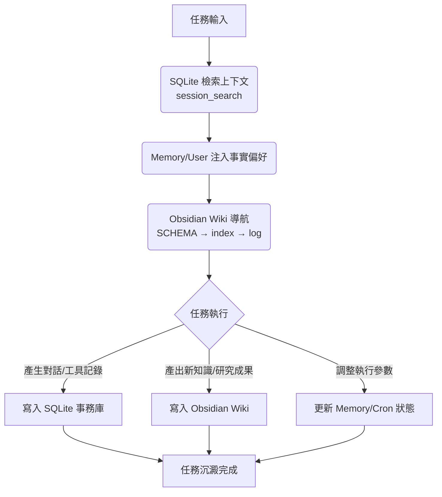

# Hermes-Agent 記憶與知識系統架構

本頁面記錄 Hermes-Agent 的三層記憶運作機制，確保 Agent 能保持高效運作、具備長期知識沉澱並保有完整的任務時序脈絡。

## 三層記憶模型

| 記憶層級 | 儲存載體 | 職責 | 關鍵屬性 |
|---------|----------|------|----------|
| **事務記憶** | **SQLite (state.db)** | 記錄全量對話歷史、工具執行結果、任務狀態、Cron 任務日誌。 | 完整性 (Transactional)、時序性 |
| **事實記憶** | **Memory (Tool)** + **SOUL.md** | 注入式的個性偏好、環境設定、穩定性事實、核心身份定義。 | 優先級 (Priority)、持久性 |
| **知識記憶** | **Obsidian Wiki** | 結構化的長期研究成果、方法論、知識圖譜。 | 關聯性 (Relational)、可讀性 |

### SOUL.md 的核心定位
- **位置**：`~/.hermes/SOUL.md` (HERMES_HOME 目錄)
- **功能**：定義 Agent 的核心身份、語氣和人格特徵
- **層級**：佔擊系統提示的 slot #legacy-1，屬於「事實記憶」層
- **特性**：跨所有對話保持一致的持久性身份檔案

---

## 綜合運作流程圖



---

## 記憶分工邏輯

1.  **SQLite (What happened)**：負責記錄「時序與過程」。當你問「上週我們討論了什麼？」或執行排程任務時，它提供絕對的歷史脈絡。
2.  **Memory + SOUL.md (Who/How)**：負責記錄「設定與偏好」和「身份定義」。這是 Agent 的「直覺」和「人格」，決定了如何與你溝通（例如：嚴禁 LaTeX、檔案傳送規範、溝通風格）。
3.  **Obsidian Wiki (Why/Definition)**：負責記錄「定義與結構」。保存複雜的模型定義、研究報告與技術框架，這是我們共同構建的「大腦」。

### SOUL.md 的具體內容規範

#### **應包含的內容**
- 語氣和溝通風格
- 直接程度和互動風格  
- 風格約束（避免什麼）
- 不確定性的處理方式
- 核心人格特徵

#### **不應包含的內容**
- 一次性項目指令
- 檔案路徑
- 倉庫慣例
- 臨時工作流程細節

#### **與其他檔案的關係**
- **SOUL.md vs AGENTS.md**：SOUL.md 定義身份風格，AGENTS.md 定義專案架構
- **SOUL.md vs /personality**：SOUL.md 是基礎持久語音，/personality 是臨時模式切換

- **前置導航**：每次對話必須執行 SQLite 檢索與 Wiki 導航。
- **知識閉環**：任務產出的高價值結論必須沉澱入 Wiki 並更新索引。
- **事務完整**：所有對話與工具呼叫自動歸檔至 SQLite，確保 Agent 無論何時都能準確接續工作。
- **身份一致性**：SOUL.md 作為核心身份檔案，確保跨所有對話保持一致的個性和風格。

## SOUL.md 最佳實踐

#### **良好的 SOUL.md 內容特徵**
- 跨上下文穩定
- 足夠廣泛以應用於一般場景
- 足夠具體以塑造語音
- 專注於溝通和身份，而非任務特定指令

#### **範例結構**
```markdown
# Personality

## Style
- 直接但不冰冷
- 優先實質而非填充
- 錯誤觀念時提出質疑
- 坦承不確定性

## What to avoid
- 諂媚
- 誇張語言
- 重複錯誤框架
- 過度解釋明顯事物
```


相關頁面：[[awesome-github-resources]]

相關頁面：[[model-error-messages]]

相關頁面：[[hermes-hierarchy-architecture]]

相關頁面：[[byterover-summary]]

相關頁面：[[hermes-hierarchy]]

相關頁面：[[skill-usage-protocol]]


## 相關節點
- [[index]]
