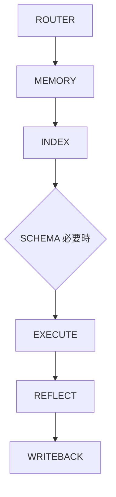

# Hermes Agent + Obsidian Wiki 工作流程規範 v2.0

**目的**：建立高效率、可擴充、低 Token 消耗、可持續進化的 Agent 工作系統。

---

## 核心原則

**Agent 不應每次都全域搜尋 Vault。**

### 優先利用 (Hierarchy of Retrieval)
1. **Router** (任務判定)
2. **Memory** (長期記憶)
3. **Index** (知識地圖)
4. **Schema** (架構規範 - 僅在必要時)

**目標**：逐層縮小範圍，實現「最快速度找到知識、最低 Token 消耗、最高長期記憶利用率」。

### 避免 (Anti-Patterns)
每次任務都無腦執行 `SCHEMA` $\rightarrow$ `INDEX` $\rightarrow$ `LOG` 循環，以防止：
- Token 浪費
- 執行速度下降
- Context 汙染
- 重複讀取相同資訊

---

## 標準工作流程 (Standard Workflow)



---

## Step 1：ROUTER (任務分類)

**目的**：判斷任務類型，決定後續路徑。

| 任務類型 | 描述 | 流程路徑 |
| :--- | :--- | :--- |
| **READ** | 查詢類 (如：什麼是 MCP？) | Router $\rightarrow$ Memory $\rightarrow$ Answer |
| **WRITE** | 建立或修改內容 | Router $\rightarrow$ Memory $\rightarrow$ Index $\rightarrow$ Schema $\rightarrow$ Execute $\rightarrow$ Writeback |
| **PROJECT** | 持續性專案 (如：維護 Wiki) | Router $\rightarrow$ Project Index $\rightarrow$ Execute $\rightarrow$ Reflect $\rightarrow$ Writeback |
| **RESEARCH** | 研究分析 (如：比較 CMS) | Router $\rightarrow$ Knowledge Index $\rightarrow$ Research $\rightarrow$ Writeback |
| **AUTOMATION** | 自動化任務 (如：新聞收集) | Router $\rightarrow$ Automation Index $\rightarrow$ Execute $\rightarrow$ Reflect $\rightarrow$ Writeback |

---

## Step 2：MEMORY (長期記憶優先)

**目的**：避免重複搜尋。

**查詢順序**：
1. `USER.md`
2. `MEMORY.md`
3. `SOUL.md`
4. Project Memory

> 若找到答案：直接執行。
> 若找不到：進入 **Step 3: INDEX**。

---

## Step 3：INDEX (快速定位)

**目的**：快速定位知識領域。**禁止全 Vault 搜尋。**

**建議工具**：`knowledge-map.yaml`

### 知識地圖範例 (Knowledge Map)
```yaml
domains:
  hermes:
    root: agents/hermes/
  obsidian:
    root: obsidian/
  quartz:
    root: publishing/quartz/
  cms:
    root: publishing/cms/
  rss:
    root: automation/rss/
  stocks:
    root: finance/stocks/
  ai:
    root: ai/
  vps:
    root: infrastructure/vps/
```

---

## Step 4：SCHEMA (架構規範)

**原則**：**僅在建立或修改文件時讀取。**

| 需要 Schema 的情況 | 不需要 Schema 的情況 |
| :--- | :--- |
| 建立文章 / 比較表 | 一般問答 / 查詢 |
| 建立專案或知識文件 | 搜尋 / 新聞摘要 |

---

## Step 5：EXECUTE (任務執行)

執行前必須確認：
- **目標** (Goal)
- **輸出** (Output)
- **限制** (Constraints)
- **回寫需求** (Writeback requirement)

---

## Step 6：REFLECT (自我反思)

**目的**：持續優化 Agent。

**反思格式**：
- `task`: 執行任務
- `result`: 執行結果
- `problem`: 遇到的問題
- `improvement`: 改進建議
- `next_action`: 下一步動作

---

## Step 7：WRITEBACK (知識沉澱)

**目的**：更新 Wiki、Index、Memory 或 Project。

### 寫入策略 (SAVE_LEVEL)
- **LEVEL 1 (永久知識)**：架構設計、系統規範、最佳實務 $\rightarrow$ **[保存]**
- **LEVEL 2 (專案知識)**：Hermes/Quartz 設定 $\rightarrow$ **[保存]**
- **LEVEL 3 (執行紀錄)**：任務摘要 $\rightarrow$ **[摘要保存]**
- **LEVEL 4 (臨時資料)**：即時新聞、一次性搜尋 $\rightarrow$ **[不保存]**

---

## Agent 自我進化規範

每次完成任務後，應進行以下自我評估：
1. 是否找到正確資訊？
2. 是否有重複搜尋？
3. 是否可建立索引？
4. 是否可建立快取？
5. 是否可建立新技能？

**若符合條件，應更新 `MEMORY.md` 或 `SELF_EVOLUTION.md`。**

---
## 相關節點
- [[agent-driven-cronjobs]]
- [[cron-jobs]]