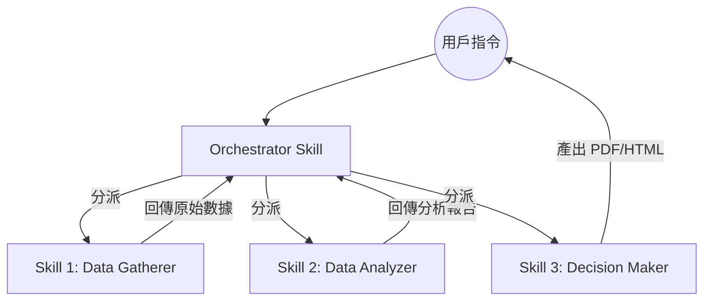

# 股市分析系統三層 Agent 協作架構

本架構將股市分析拆分為三個專業 Agent Skill，實現數據與決策分離。

## 1. 系統層級圖 (Mermaid)

## 2. 技能職責說明

### Skill 1: ws-data-gatherer
- **職責**：數據採集。
- **工具**：TWSE OpenAPI, FinMind, OpenBB, News Scraping.
- **輸出**：標準化 JSON 格式數據字典。

### Skill 2: ws-data-analyzer
- **職責**：數據校驗與價值因子計算。
- **重點**：計算 PE/PB/EPS 連續性、ROE 成長趨勢、排除週末缺失值、異常值過濾。

### Skill 3: ws-decision-maker
- **職責**：投資決策。
- **重點**：綜合評分 (0-100)、風險評估矩陣、輸出機構風格 (Institutional-grade) 的 Markdown/PDF/HTML 格式報告。

## 3. 開發規範
- **語言**：全繁體中文介面與代碼註解。
- **錯誤處理**：若 Skill 1 資料抓取失敗，必須在 Skill 2 中加入重試 (Retry) 邏輯。
- **檔案處理**：所有數據傳遞嚴禁使用 Telegram API `MEDIA` 參數，一律透過 `telegram-message-file-sender`。

---
## 相關節點
- [[stock-analysis-system-guide]]
- [[stock-analysis-workflow-full]]