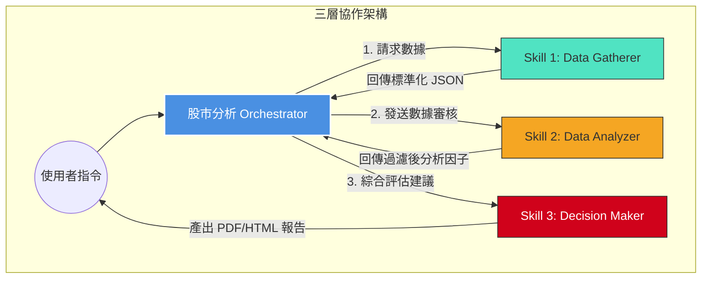

# 股市分析三層 Agent 協作系統使用說明

本系統透過 Orchestrator 調度三個專業 Skill，實現從數據擷取、分析到決策的全自動化流程。

## 1. 系統運行流程



## 2. 使用方法

### 步驟 A：環境初始化
1. 確保已建立三個專屬 Skill 目錄 (`ws-data-gatherer`, `ws-data-analyzer`, `ws-decision-maker`)。
2. 配置各個 Skill 的 `SKILL.md` 定義其專屬工具集 (Toolsets)。

### 步驟 B：調用方式
透過 `hermes-wallstreet-orchestrator` 呼叫主流程。在 Python 環境中執行：

```python
from hermes_tools import delegate_task

# Orchestrator 核心調度邏輯
def run_analysis(ticker):
    # 1. 擷取 (Gatherer)
    data = delegate_task(goal=f"擷取 {ticker} 財務/新聞數據")
    
    # 2. 分析 (Analyzer)
    factors = delegate_task(goal=f"計算 {ticker} 價值因子與動能", context=data[0])
    
    # 3. 決策 (Decider)
    report = delegate_task(goal=f"產出 {ticker} 投資報告", context=factors[0])
    
    return report[0]
```

## 3. 重要注意事項
- **狀態傳遞**：由於每個 Agent 環境隔離，數據均透過 `context` 參數傳遞，務必確保數據字典格式統一 (建議使用 JSON)。
- **交付規範**：最終產出文件（PDF/HTML）一律透過 `telegram-message-file-sender` 技能發送，嚴禁使用 `MEDIA` 參數。
- **維護規範**：每次架構層級變更或邏輯更新，須同步更新本頁面的 Mermaid 流程圖。

---
## 相關節點
- [[stock-analysis-workflow-full]]
- [[quant-python-ai-agent]]