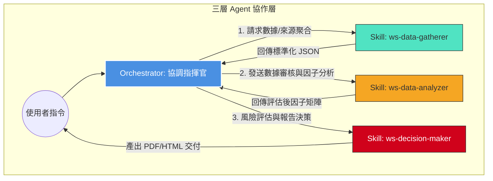

# 股市分析系統：執行流程與操作規範

本文件為股市分析三層 Agent 協作系統的操作說明，詳細定義了數據流轉、各層級 Agent 職責及執行指令。

## 1. 系統協作架構流程圖


## 2. 執行操作方法

### 第一步：Orchestrator 初始化調用
系統透過一個中央 Orchestrator 進行任務調派。使用者僅需觸發 Orchestrator，無需個別呼叫子 Skill。

```python
# 調用範例
from hermes_tools import delegate_task

def execute_full_analysis(ticker):
    # 統一 Orchestrator 流程
    final_output = delegate_task(
        goal="啟動股市三層分析流程",
        context=f"分析對象：{ticker}",
        toolsets=["terminal", "web"]
    )
    return final_output
```

### 第二步：各層級 Agent 任務內容
| 階段 | 職責 | 關鍵任務 |
| :--- | :--- | :--- |
| **Gatherer** | 數據採集與聚合 | 整合多源數據 (TWSE/Yahoo/FinMind)，執行搜尋引擎聚合邏輯，進行基礎去重與格式化。 |
| **Analyzer** | 數據審計與因子計算 | 檢核數據品質、排除異常值、計算 PE/PB/ROE 及動能因子。 |
| **Decider** | 決策輸出與交付 | 綜合評分、風險評估、依機構標準格式產出報告，並以 `telegram-message-file-sender` 交付結果。 |

## 3. 關鍵規範
- **搜尋引擎聚合邏輯**：採集層必須實作多源交叉驗證，對於不同來源數據需計算中位數，並標記可靠度。
- **錯誤處理 (Circuit Breaker)**：若任何一個層級產生 `validity: false` 的標記，Orchestrator 須立即中斷流程並提示使用者修正數據來源。
- **交付硬性限制**：
    - **禁止**：使用 `send_message` 的 `MEDIA` 參數。
    - **強制**：使用 `telegram-message-file-sender` 配合絕對路徑進行檔案傳送。
    - **LaTeX 禁止**：全線輸出 Unicode 符號 (→, ⇒, ±)。

## 4. 維護檢查表 (Checklist)
- [ ] 執行分析前，確認 `network_utils.py` 速率控制已啟動。
- [ ] - [ ] 確認資料來源間的 Ticker 代號格式一致（已建立 `ticker_map.json` 進行正規化）。
- [ ] 確認最終產出文件已使用 `telegram-message-file-sender` 交付。
- [ ] 審核報告前，確認已進行「數據品質標註」檢查。

---
## 相關節點
- [[quant-python-ai-agent]]
- [[stock-data-sources]]