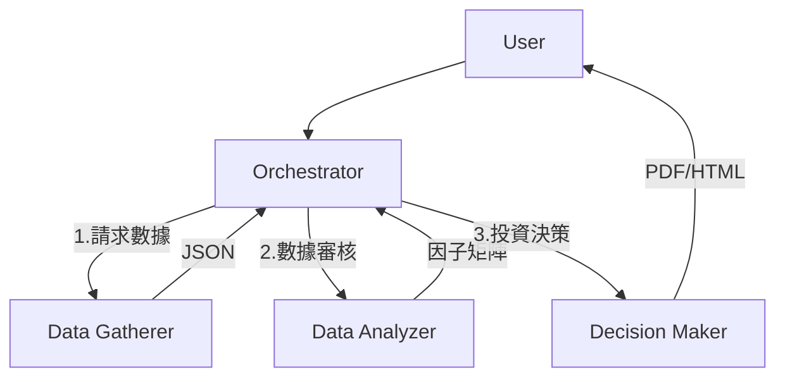

# Investment Resources

投資與股市研究的整合知識：選股策略、ETF 資料、API 來源、Agent 分析架構。

---

## 投資大師選股策略速查

| 類型 | 代表 | 核心策略 | 關鍵指標 |
|:---|:---|:---|:---|
| 動能 | 墨菲、米尼維尼、達華斯、李佛摩 | 順勢交易、嚴格停損 | 價格動能、成交量、箱型突破 |
| 價值 | 巴菲特、蒙格、卡拉曼、格拉罕、奈夫 | 安全邊際、低估值 | PE、PB、護城河 |
| 成長 | 林區、費雪、歐尼爾、伍德 | 顛覆式創新、成長股 | GPEG、ROIC、營收成長 |
| 反向 | 科斯托蘭尼、伯里、伊坎、索羅斯 | 逆向投資、反身性 | 市場心理、總經 |
| 量化 | 西蒙斯、葛林布雷、達里歐 | 模型、全天候 | 數學公式、資產配置 |

---

## ETF 基本資料與 API

### TWSE 數據

- 來源：[data.gov.tw/dataset/157399](https://data.gov.tw/dataset/157399)
- API：`GET https://mopsfin.twse.com.tw/opendata/t187ap47_L.csv`
- 256 檔 / 29 欄位 / 每月更新 / 免費

### 類型統計

| 類型 | 數量 |
|:---|:---|
| 國外成分證券指數股票型基金 | 92 |
| 國內成分證券指數股票型基金 | 66 |
| 槓桿/反向 | 51 |
| 國內主動式 ETF | 16 |

重要代號：0050 / 0051 / 0056 / 0061 / 00631L / 00632R

### 注意事項

- 編碼 UTF-8 with BOM
- 日期格式：民國年 MMDD → 西元年 = 民國年 + 1911
- 主動式 ETF 無追蹤指數

---

## 股市資料 API 比較

| 優先 | 來源 | 功能 | 限制 |
|:---|:---|:---|:---|
| 1 | TWSE OpenAPI | 台股日價/財報 | 批次每日1次 |
| 2 | TPEX OpenAPI | 上櫃/興櫃 | 同上 |
| 3 | FinMind | 法人/融資/月營收 | 100~600 req/hr |
| 4 | OpenBB | 統一介面 | 部分付費 |
| 5 | yfinance | 美股/ETF | 中等穩定性 |

### Agent 資料分工

| 資料 | 來源 |
|:---|:---|
| 台股/OTC 股價 | TWSE/TPEX OpenAPI |
| 月營收/財報/法人 | FinMind |
| 美股 ETF | yfinance |
| 美國財報 | FMP |
| 新聞 | Finnhub |
| 宏觀 | OpenBB |

### 注意事项

- CSV 編碼 UTF-8-BOM
- 三大法人 16:00-17:00 更新
- 請求間隔 > 100ms

## Manus 案例對照

1. **SQLite 私有數據層**（最高優先）：`get_stock_price()` / `get_financials()` / `get_pe_pb()`
2. **自動化投資備忘錄**（中優先）：摘要 + Infographic + Email
3. **財報異常偵測看門狗**（中優先）：每月 Cron 掃描 ±20% → Telegram

---

## Gemini API 定價摘要

| 模型 | 輸入 | 輸出 | 定位 |
|:---|:---|:---|:---|
| gemini-2.5-flash-lite | $0.10 | $0.40 | 最便宜 |
| gemini-3.1-flash-lite | $0.25 | $1.50 | 翻譯/處理 |
| gemini-2.5-flash | $0.30 | $2.50 | 混合推理 |
| gemini-3.1-pro | $2.00 | $12.00 | 最先進 |
| gemini-2.5-pro | $1.25 | $10.00 | 編程/複雜推理 |

**降本技巧**：批次 API 降 50%、脈絡快取省輸入費、Flash-Lite 最便宜文字模型

---

## 三層 Agent 分析系統

### 技能職責

| Skill | 職責 | 輸入/輸出 |
|:---|:---|:---|
| ws-data-gatherer | 數據採集（TWSE/FinMind/yfinance/News） | ticker → JSON |
| ws-data-analyzer | 因子計算（PE/PB/ROE/動能）+ 異常過濾 | JSON → 因子矩陣 |
| ws-decision-maker | 綜合評分(0-100) + 風險評估 + 報告產出 | 因子 → PDF/HTML |

### 關鍵規範

- 全繁體中文 + Unicode（禁用 LaTeX）
- `telegram-message-file-sender` 交付
- Circuit Breaker：`validity=false` 立即中斷
- Ticker 格式通過 `ticker_map.json` 正規化

### S&P 500 成分股

- 來源：[SlickCharts](https://www.slickcharts.com/sp500)
- 欄位：Ticker / Company / Price / % Change / Market Cap / Weight / Sector

---

## 相關頁面

- [[finance/finance-index]]
- [[entities/news-and-market-examples]]
- [[concepts/ai-toolkit]]
