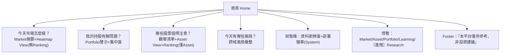
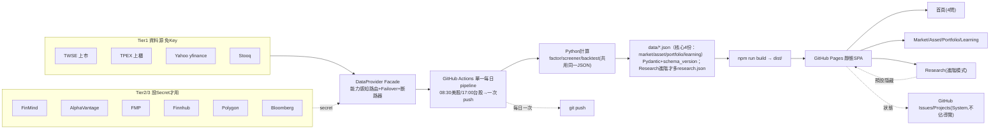

# quant-dashboard 簡化架構 v3.0（架構規劃主文）

> **本頁角色**：架構「規劃與設計依據」——回答「為什麼這樣設計」。所有設計決策、Domain 劃分、Provider 策略、Phase 路線、檔案樹皆在此。
> **可部署 Skill 正文（執行規範）**：[[quant-dashboard-skill|quant-dashboard 可部署 Skill]]——回答「觸發後做什麼 / 怎麼做」，隨時可註冊上線。
> 分工：**改設計 → 改本頁；改執行流程 → 改 Skill 頁**。兩頁章節一一對應（見下表）。

以**使用者任務**為核心：不問「我有什麼功能」，只問「使用者來做什麼」。架構以 Domain 分類，每 Domain 只回答一個問題。這是對「功能堆疊」思維的減法重構——8 原模組 → 5 Domain + 首頁，核心 JSON 契約砍併為 4 份；目標不是功能最多，而是最容易維護 / Fork / 理解 / 長期發展。

### 文件對應表（主文 ↔ Skill）
| 主文章節（設計依據） | Skill 章節（執行規範） | 對應內容 |
|----------------------|------------------------|----------|
| §0 三個判準 | 七、執行鐵律 / 八、架構憲法 | 優先序與取捨準則 |
| §1 Domain 架構 | 六、5 Domain 契約 | 5 Domain + 首頁（任務導向） |
| §2 降級 View/Tool | 六、契約備註 | Ranking 僅 Asset 等歸屬 |
| §3 Z100 精選 | 八、新增功能閘門 | 功能取捨依據 |
| §4 新手心態 | 七、鐵律 #4/#11 | 空狀態引導 / 新鮮度 banner |
| §5 執行效率與維護 | 九、Phase 路線 | Build-Time 單一 pipeline |
| §6 Phase Roadmap | 九、Phase 路線 | Phase0/1/2 範圍 |
| §7 刪除/延後清單 | 八、閘門 | 砍除項目 |
| §8 架構憲法 | 八、憲法與閘門 | 合規檢查 |
| §9 架構圖 | 五、Provider Layer / 十、驗證清單 | 資料流與驗證 |
| §10 預設檔案結構 | 三、執行流程 / 五、Provider | 預設 repo 樹 |

## 0. 三個判準
| 判準 | 不通過處理 |
| 執行效率 | 砍除或併入既有 Build 流程 |
| 系統維護 | 非核心不新增契約/Provider/開關 |
| 新手心態 | 砍除或預設隱藏+風險提示 |

優先順序：新手心態 > 系統維護 > 執行效率

## 1. Domain 架構（使用者任務）
首頁為跨域複合視圖，非獨立模組。5 導覽 Domain + System（不佔導覽）。

| Domain | 只回答一個問題 | 內含（功能折併） | 使用頻率 | 唯一 CTA |
|--------|--------------|-----------------|---------|---------|
| **首頁** | 今天市場怎樣？我的持股有無問題？哪些股值得注意？今天有哪些風險？ | Market摘要+Portfolio警示+觀察清單+風險彙整+狀態條 | 每日 | — |
| **Market 市場** | 今天市場怎麼樣？ | 指數K線+漲跌家數+三大法人；Heatmap/Ranking/News 為 View | 每日 | 看個股 ↓ |
| **Asset 標的** | 這檔值得研究嗎？我想找股票？ | 個股頁+ETF專區；Screener/Compare 為 Tool；折溢價/財報燈號/風險燈/情緒燈/填權/除息月曆 為 View | 每日/每週 | 加入觀察／加入持股 |
| **Portfolio 投資組合** | 我的投資現在如何？ | 持倉+績效+集中度警示+定期定額試算 | 每日 | 更新持股 |
| **Research 研究** | 我的策略有效嗎？ | 策略與回測(簡化)；Report 為 View；Replay 為 Tool(延後) | 低頻→進階模式 | 開始回測 |
| **Learning 學習** | 我想學習什麼？ | 財報辭典+行事曆+「如果當初買了」試算+風險教育卡 | 每週 | 開始學習 |
| **System 系統** | 平台狀態／治理 | 部署徽章+資料新鮮度+Issues+Projects+P1-P8體檢 | 背景 | —（不佔導覽） |

導覽順序（PM 頻率排序）：首頁 → Market → Asset → Portfolio → Learning → 〔進階〕Research。System 僅首頁狀態條 + GitHub 原生。

## 2. 降級為 View / Tool（非一級導覽）
| 項目 | 性質 | 歸屬 |
|------|------|------|
| Heatmap | View | Market |
| Ranking | View | **僅 Asset**（Market 層級只看好壞，無 Ranking） |
| News | View（資訊流） | Market / Asset |
| Calendar | Tool | Learning |
| Compare | Tool（個股頁內「加入比較」） | Asset |
| Report | View | Research |
| Replay | Tool（延後，低頻+運算貴） | Research |

## 3. Z100 精選（18 項）
全複用既有 JSON/計算，無新增 Provider/Workflow。

| 原編號 | 功能 | 歸屬 |
|--------|------|------|
| #9 | 資料新鮮度提示條 | 首頁/System |
| #8 | 部署狀態徽章 | System（首頁狀態條） |
| #22 | 財報成長趨勢燈號 | Asset(View) |
| #30 | 個股風險警示燈 | Asset/首頁 |
| #46 | 持倉集中度警示 | Portfolio |
| #47 | 定期定額試算器 | Portfolio(Tool) |
| #77 | 除權息倒數提醒卡 | Learning/Asset |
| #76 | 日曆訂閱(.ics) | Learning(Tool)【延後進階：低頻】 |
| #95 | 「如果當初買了」試算器 | Learning(Tool) |
| #71 | 規則式情緒燈號(非AI) | Asset(View) |
| #29 | 除權息填權速度 | Asset(View) |
| #35 | 高股息ETF除息月曆 | Asset【除權息三項#29/#35/#77全歸Asset】 |
| #31 | ETF折溢價追蹤 | Asset(View) |
| #36 | ETF費用侵蝕試算 | Asset/Learning |
| #58 | 回測版本快照 | Research |
| #81/#83 | Issue Template / Projects看板 | System（GitHub原生，合為治理註腳，移出功能表） |
| #100 | P1-P8自我體檢報告 | 改 CI 自動機制（移出功能表） |

排除：#14恐慌貪婪、#53 Walk-Forward、#65因子權重優化→降級/刪除

## 4. 新手心態設計準則
| 準則 | 規則 |
|------|------|
| 首頁不像 Bloomberg/TradingView/券商 | 只答4問，<30s理解 |
| 不做即時盤中資訊 | 全站前日收盤，首頁標「非即時」 |
| 排行不強調短期漲跌 | 預設近1年，當日需手動切+提示 |
| 不做競賽/排行遊戲 | 模擬競賽/貢獻者排行一律不做 |
| 量化研究預設收合 | Research 進階模式 |
| AI/合理價不做預設 | 標輔助資訊、預設關閉(設Key才出) |
| 槓桿/衍生品不進首屏 | 附教育卡、不進預設選單 |
| 教育優於進階工具 | Learning 排 Research 前 |
| 每排行附「非建議」提示 | 所有排序頁統一footer |

## 5. 執行效率與維護
- 全站共用單一每日 Actions pipeline 產 `data/*.json`；無新 Workflow
- 禁止重複抓資料/重複計算；Build Time 固定
- 學習中心靜態資料，不佔每日排程
- 排行/Heatmap 複用既有因子價格，只改呈現
- 回測縮小範圍（不做 Walk-Forward/蒙地卡羅）
- 8 原模組 → 5 Domain+首頁；**核心 JSON 契約砍併為 4 份（market/asset/portfolio/learning）**

## 6. Phase Roadmap
| Phase | 範圍 |
|-------|------|
| 1 核心 | 首頁+Market+Asset+Portfolio+Learning+System狀態條 |
| 2 進階選配 | Research(回測)+因子中性化/Compare/Replay/AI摘要(設Key) |

無Phase 3/4：後端模組與百科系列已砍/併。

## 7. 刪除/延後清單
| 類別 | 項目 | 處置 |
|------|------|------|
| 模組 | K Replay/O Snapshot/T Report | 刪除 |
| 模組 | 6.13-6.15 Chat/Task/Settings | 刪除(違Fork First) |
| View/Tool | Replay | 延後Phase2 |
| Z100 | 其餘82項 | 延後/刪除 |
| 心態 | #91競賽/#85貢獻排行 | 刪除 |
| 心態 | #14恐慌貪婪/#37槓桿ETF/#17價差 | 延後+風險卡 |

## 8. 架構憲法（Architecture Constitution）

每一次修改 Blueprint，都必須遵守。核心思維：**不問「能不能做」，只問「應不應該做」**。

### 憲法八條
1. 新增功能之前，先思考：是否可以共用現有功能？而不是新增模組。
2. 新增模組之前，先思考：是否可以共用現有 Domain？而不是新增 Domain。
3. 新增 Workflow 之前，先思考：是否可以共用現有 Workflow？
4. 新增 JSON 之前，先思考：是否可以共用現有 Data Contract？
5. 新增 Provider 之前，先思考：Tier1 Provider 是否已經足夠？
6. 若功能只有少數人使用，預設：Optional，而不是 Core。
7. 若功能增加 Workflow/Provider/Schema/Build Time/維護成本，請重新評估是否值得。
8. 任何修改都必須遵守：Simple is Better than Complex. Less is More. User First. Fork First. Long-term Maintainability First.

### 新增功能閘門
任何新增功能先過閘門。全答「是」才進 MVP；**任兩項「否」→ 延後 / Optional / 刪除**。

| # | 閘門 | 否的含意 |
|---|------|---------|
| 1 | 是不是 MVP？ | 非核心，延後 |
| 2 | 是不是每天有人使用？ | 低頻，進階/Optional |
| 3 | 值得增加維護成本？ | 刪除 |
| 4 | 值得增加 Build Time？ | 延後/刪除 |
| 5 | 值得增加 Workflow？ | 延後/刪除 |
| 6 | 值得增加 JSON？ | 合併既有/刪除 |
| 7 | 值得增加 Provider？ | 延後/不進核心 |
| 8 | 值得增加 Schema？ | 合併既有/刪除 |

本專案最大目標**不是功能最多**，而是：最容易維護、最容易 Fork、最容易理解、最容易長期發展。

## 9. 架構圖（Mermaid）

### 圖 1：首頁呈現（4 問）


### 圖 2：整體工作架構


## 10. 預設檔案結構（Default Repo Tree）

依 §三解耦（Python fetch→計算→`data/*.json`→前端 DataClient 讀）、§四 Provider 套件、§五技術棧、§八 Phase0 骨架與雙排程收斂。以下為 Fork 後的預設骨架，**路徑為建議值，可調整**（例如 React 也可放 repo 根而非 `web/`）：

- `market/`：處理市場相關的一切。
- `asset/`：處理股票與 ETF 的一切。
- `portfolio/`：處理投資組合的一切。
- `research/`：處理策略、因子、回測。
- `learning/`：處理教學內容。

```text
quant-dashboard/
├── .github/
│   └── workflows/
│       ├── daily-tw.yml                 # 台股每日更新
│       ├── daily-us.yml                 # 美股每日更新
│       └── deploy.yml                   # GitHub Pages 部署
│
├── scripts/                             # Build Time（Python 3.11）
│   ├── shared/                          # 共用核心
│   │   ├── schema.py                    # Pydantic Data Contract
│   │   ├── types.py                     # 共用資料型別
│   │   ├── constants.py                 # 常數
│   │   ├── utils.py                     # 工具函式
│   │   └── logger.py                    # Log
│   │
│   ├── providers/                       # Data Provider Layer
│   │   ├── base.py
│   │   ├── facade.py                    # Provider Router + Failover
│   │   ├── registry.py
│   │   ├── exceptions.py
│   │   │
│   │   ├── builtin/                     # Tier1（免 API Key）
│   │   │   ├── twse.py
│   │   │   ├── tpex.py
│   │   │   ├── yahoo.py
│   │   │   └── stooq.py
│   │   │
│   │   └── optional/                    # Tier2 / Tier3
│   │       ├── finmind.py
│   │       ├── alphavantage.py
│   │       ├── fmp.py
│   │       ├── finnhub.py
│   │       ├── polygon.py
│   │       └── bloomberg.py
│   │
│   ├── market/                          # Market Domain
│   │   ├── fetch.py
│   │   ├── calculate.py                 # 含 Breadth 廣度指標（±4% 動能/趨勢窗，參考 stock-screener）
│   │   └── export.py
│   │
│   ├── asset/                           # Asset Domain（Stock + ETF）
│   │   ├── fetch.py
│   │   ├── factor.py
│   │   ├── screener.py                  # 綜合評分模型（Minervini/CANSLIM 通過條件→評分門檻，參考 stock-screener）
│   │   ├── ranking.py                   # Composite rating：Strong Buy≥80/Buy≥70/Watch≥60/Pass<60
│   │   ├── compare.py
│   │   └── export.py
│   │
│   ├── portfolio/                       # Portfolio Domain
│   │   ├── calculate.py
│   │   ├── rebalance.py
│   │   └── export.py
│   │
│   ├── research/                        # Research Domain（Phase2）
│   │   ├── strategy.py
│   │   ├── factor.py
│   │   ├── backtest.py
│   │   └── export.py
│   │
│   ├── learning/                        # Learning Domain（Phase2）
│   │   └── export.py
│   │
│   └── main.py                          # Build 入口
│
├── data/                                # Build Time Output
│   ├── market.json
│   ├── asset.json
│   ├── portfolio.json
│   ├── learning.json
│   ├── research.json
│   ├── user.json                        # Demo Portfolio / Watchlist / Settings
│   └── schema-version.json
│
├── shared/                              # Frontend / Backend 共用
│   ├── schema.ts
│   ├── types.ts
│   ├── constants.ts
│   └── version.ts
│
├── web/                                 # React + Vite
│   ├── app/
│   │   ├── App.tsx
│   │   ├── main.tsx
│   │   └── router.tsx
│   │
│   ├── routes/
│   │   ├── dashboard.tsx                # 首頁 4 問複合視圖
│   │   ├── market.tsx                   # Heatmap View（無 Ranking）
│   │   ├── asset.tsx                    # 個股/ETF + Screener/Compare Tool
│   │   ├── portfolio.tsx                # 持倉/績效/集中度
│   │   ├── learning.tsx                 # 學習中心（Phase2 進階）
│   │   └── research.tsx                 # 回測報告（Phase2 進階模式，預設隱藏）
│   │
│   ├── components/
│   │
│   ├── shared/
│   │   ├── data-client.ts               # 讀 data/*.json（含 dataState/新鮮度 banner）
│   │   ├── hooks/
│   │   └── utils/
│   │
│   ├── assets/
│   │
│   ├── vite.config.ts
│   ├── tailwind.config.ts
│   └── tsconfig.json
│
├── tests/
│   ├── unit/
│   ├── contract/
│   ├── integration/
│   └── e2e/
│
├── docs/
│   ├── blueprint.md
│   ├── architecture.md
│   ├── provider.md
│   ├── data-contract.md
│   ├── development.md
│   └── roadmap.md
│
├── README.md
├── Makefile
├── package.json
├── pyproject.toml
└── LICENSE
```

**約定**
- `scripts/` 全 Build Time（Python 3.11，免 DB）；`scripts/shared/` 為跨 Domain 共用核心（`schema.py` 即 Pydantic Data Contract 單一真相）；各 Domain 拆 `market/ asset/ portfolio/ research/ learning/` 子目錄，職責單一（fetch→calculate/factor/screener/ranking/compare→export），`main.py` 為 Build 入口。
- `scripts/providers/` 一次到位（Phase0 即含 `base/facade/registry/exceptions`，非分階），符合 §四 v2 統一設計；`builtin/` 為 Tier1 免 key，`optional/` 為 Tier2/3（僅 secret 存在才實例化）。`facade.py` = Router + Failover + 斷路器 + 超時。
- `data/*.json` 為單一真相（Data Contract）；`schema-version.json` 記錄 `schema_version`，與 `shared/version.ts` 對齊，CI 斷言。
- `user.json` 取代舊 `lots.csv`：內建 demo（Portfolio / Watchlist / Settings），Fork 後首頁不空白；使用者個人化改自己 repo，真實持倉不 push（鐵律#7）。
- `shared/`（根層）= Frontend/Backend 共用型別與版本（`schema.ts`/`types.ts`/`constants.ts`/`version.ts`），對齊 `scripts/shared/`，避免前後端漂移。
- 前端 Static First：只經 `web/shared/data-client.ts` 讀 `data/*.json`，禁直打 API / import 具體 provider（紅線#1/#10）；`routes/dashboard.tsx` 對應首頁 4 問。
- **可借鏡參考**：`asset/` 的 screener/ranking 評分模型、`market/` 的 Breadth 指標定義參考自 xang1234/stock-screener（見 resource §十映射表）；其 Static Site「預匯出 JSON→Pages 只讀」模式驗證本架構正確，但後端堆疊/AI/多市場不引入。
- `tests/` 拆 `unit/contract/integration/e2e`：P1 至少 `unit`+`contract`（pytest 斷言 JSON 符合 contract）；P2 補 `integration`+`e2e`（Vitest + Playwright）。
- `docs/` 收錄架構文件（blueprint/architecture/provider/data-contract/development/roadmap），對應本主文與 Skill 頁。
- `research.json`、`web/routes/research.tsx`、`learning.tsx` 屬 Phase2 進階，Fork 零 secret 時仍可跑 3 核心 Domain + 首頁（鐵律#1）。

## 相關資源
- [[quant-dashboard-skill|可部署 Skill 正文（執行規範）]]
- [[finance/quant-dashboard-prompt|實作紀錄]]
- [[finance/quant-dashboard-qa-1|Q&A第一批]]
- [[finance/quant-dashboard-qa-2|多角色審查]]
