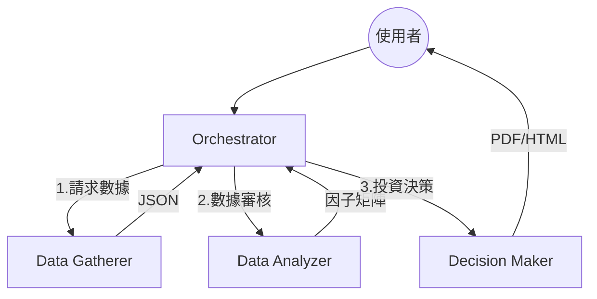

# 股市分析三層 Agent 系統

## 系統流程圖

## 技能職責

| Skill | 職責 | 輸入/輸出 |
|:---|:---|:---|
| ws-data-gatherer | 數據採集（TWSE/FinMind/yfinance/News） | ticker → JSON |
| ws-data-analyzer | 因子計算（PE/PB/ROE/動能）+ 異常過濾 | JSON → 因子矩陣 |
| ws-decision-maker | 綜合評分(0-100) + 風險評估 + 報告產出 | 因子 → PDF/HTML |

## 資料مصادر

### API
- [TWSE OpenAPI](https://openapi.twse.com.tw/)：上市股日價/財報
- [TPEX OpenAPI](https://www.tpex.org.tw/openapi/)：上櫃/興櫃
- [FinMind](https://finmindtrade.com/)：法人/融資/月營收
- [OpenBB](https://openbb.co/)：統一介面
- [yfinance](https://github.com/ranaroussi/yfinance)：美股 ETF

| 資料 | 來源 |
|:---|:---|
| 台股/OTC 股價 | TWSE/TPEX OpenAPI |
| 月營收/財報/法人 | FinMind |
| 美股 ETF | yfinance |
| 美國財報 | FMP |
| 新聞 | Finnhub |

### 手動 CSV
- TWSE bwibbu-day : 收盤/殖利率/PE → `data.gov.tw/dataset/11547`
- TPEX 上櫃 Pe Pb 行情 : `data.gov.tw/dataset/11373/11370`
- ETF 基本資料 : `data.gov.tw/dataset/157399`（256檔）

## 關鍵規範

- 全繁體中文 + Unicode 符號（禁用 LaTeX）
- 交付：`telegram-message-file-sender` + 絕對路徑
- 禁止 `send_message` 的 `MEDIA` 參數
- Circuit Breaker：`validity=false` 立即中斷
- Ticker 格式通過 `ticker_map.json` 正規化

## 維護檢查表

- [ ] `network_utils.py` 速率控制啟動
- [ ] Ticker 代號格式一致
- [ ] 最終產出使用 `telegram-message-file-sender`
- [ ] 報告經「數據品質標註」檢查
