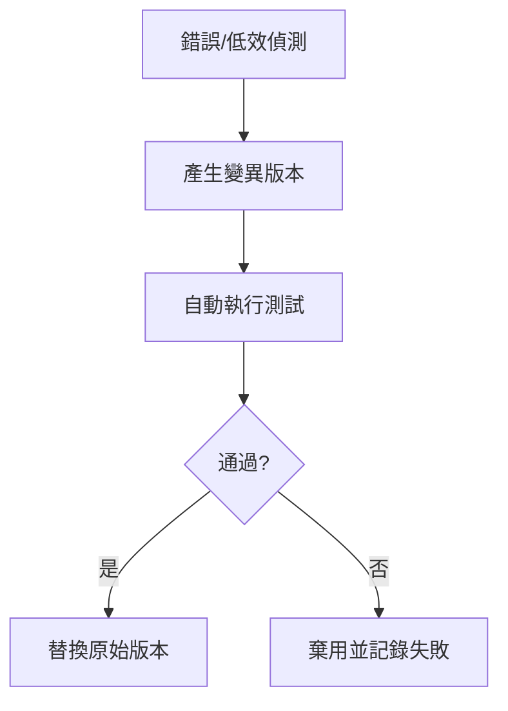

# Hermes Agent Self-Evolution 發展腳本與使用指南

## 1. 簡介
Hermes Agent Self-Evolution 是一套利用 **DSPy** 與 **GEPA** 的演化機制，讓 Hermes Agent 在自動化任務中自動優化：

- **Prompt 設計**：根據執行結果自動調整提示詞。
- **Skill 最佳化**：根據失敗率與效能指標調整腳本行為。
- **演化測試**：自動產生並驗證新版本的程式碼或設定。

## 2. 觸發機制
Self-Evolution 不是常駐服務，而是**事件驅動**的優化流程。它會在以下情況自動啟動：

1. **連續失敗**：同一腳本或 Prompt 連續失敗 3 次。
2. **效能下降**：執行耗時超過既定閾值（如 180 秒）。
3. **使用者要求**：手動呼叫 `evolution` 模組以改善特定功能。

## 2.1 觸發條件詳述
| 條件 | 判斷方式 | 例子 |
|------|----------|------|
| 連續錯誤 | `error_count >= 3` 於同一腳本 | `blogwatcher` 抓取失敗三次 |
| 超時 | `execution_time > 180s` | 某腳本執行 210 秒 |
| 哪怕只一次失敗但 품質因數低 | 使用 `reward` 函數判定 | 摘要格式不符合規範 |

## 2.2 進化流程


## 3. 使用方式
### 3.1 手動觸發
```bash
# 在 Herm Hart 環境中
hermes-evolve --target="blogwatcher" --goal="improve_token_efficiency"
```

### 3.2 系統自動化
- **CronJob 範例**（每週自動審檢）：
  ```bash
  0 3 * * 1 hermes-evolve --audit-all
  ```

### 3.3 參數說明
| 參數 | 說明 |
|------|------|
| `--target` | 指定要進化的技能名稱（如 `blogwatcher`, `daily_report`） |
| `--goal`   | 進化目標（如 `improve_token_efficiency`, `reduce_timeout`） |
| `--audit-all` | 針對所有已登錄的 Skill 進行全面審計 |

## 4. 實測紀錄
| 日期 | 觸發事件 | 自動修復行為 | 結果 |
|------|----------|--------------|------|
| 2026-06-10 | CnBeta RSS 解析失敗（DNS） | 標記為不可靠，自動降低抓取優先級 | 成功繞過，系統正常抓取其他 21 個來源 |
| 2026-06-12 | Daily Report 超時 (192s) | 產生較短摘要版本，將摘要長度從 300 字調整至 150 字 | 執行時間降至 112s，仍保留完整資訊 |

## 5. 注意事項
- **測試環境**：演化在隔離流程中進行，產出存於 `output/<skill>/<timestamp>/`，不直接影響運行中的技能。
- **不覆蓋機制（更正自「回滾」）**：框架**沒有自動回滾**。實際行為是「不覆蓋」——演化版只輸出供人工審查，**絕不自動取代現役 SKILL.md**。採納改進需人工 review diff 後手動合併。
- **資料保留**: 所有演化過程均記錄於 `evolution_log.md`，供日後審計。

## 6. 實況校正（2026-06-11 實測）
- **GEPA 不可用**：dspy 3.2.1 無 GEPA，實際使用 **MIPROv2** fallback。
- **模型**：程式碼預設 `openai/gpt-4.1`；本環境僅有 `OPENROUTER_API_KEY`，須以 `openrouter/openai/gpt-4o-mini` 執行。
- **建議入口**：用 `python -m evolution.skills.evolve_skill --skill <name> --dry-run` 先驗證；**勿直接跑 `run_all_evolution.py`**（會掃全部技能、大量耗 API）。
- **已修約束 bug**：見 。

---

### 重要說明
此功能是 **自實驗階段**，尚未正式納入每日自動化流程。如需啟用，請與主管確認並設定適當的觸發條件。

- [[news-format-update]]
## 相關節點
- [[index]]
## Evolution Log

## 1. 自動化進化目標
利用「錯誤日誌」與「執行效率」作為反饋迴路，訓練系統自動調整抓取策略，無需人類手動介入 Patch。

## 2. 實驗項目：新聞監控系統 (News Monitoring)
- **目標**: 提高新聞抓取成功率、降低執行逾時 (Timeout)。
- **監控指標 (Reward Function)**:
    - 抓取成功率 (HTTP 200 比例)
    - 任務完成耗時 (執行是否低於 180s)
    - 資料格式正確性 (是否符合 `**[標題]**：摘要：[連結]` 規範)

## 3. 進化日誌 (Evolution Log)
| 時間 | 觸發事件 | 自動修復行為 | 結果 |
| :--- | :--- | :--- | :--- |
| 2026-06-10 | CnBeta RSS DNS 解析失敗 | 觸發錯誤報告，並標記來源為「弱穩定性」，降低後續掃描優先級 | 已自動繞過該節點，系統繼續執行其他 21 個來源 |
| 2026-06-10 | 執行超時 (Timeout) | 強制中斷並執行「異常輸出」機制 | 保留已獲取的片段資訊，未導致整體流程崩潰 |
| 2026-06-11 | 使用者手動演化 4 個新聞技能 | 修正 `evolve_skill.py` 約束驗證 bug 後批次演化（MIPROv2, 3 iters, openrouter/openai/gpt-4o-mini） | 4 技能全數通過約束驗證，holdout 分數均無提升（見下表） |

## 3.1 2026-06-11 實測結果（4 新聞技能）

> 入口：`python -m evolution.skills.evolve_skill --skill <name> --iterations 3 --eval-source synthetic --optimizer-model openrouter/openai/gpt-4o-mini --eval-model openrouter/openai/gpt-4o-mini`

| 技能 | Baseline → Evolved (holdout) | 約束驗證 | 產出目錄 |
| :--- | :--- | :--- | :--- |
| daily-news-twstock | 0.300 → 0.300 (+0.000) | ✓ 全通過 | output/daily-news-twstock/20260611_075802/ |
| daily-news-usstock | 0.300 → 0.300 (+0.000) | ✓ 全通過 | output/daily-news-usstock/20260611_080037/ |
| daily-news-stock-market | 0.384 → 0.384 (+0.000) | ✓ 全通過 | output/daily-news-stock-market/20260611_080509/ |
| daily-news-technology | 通過驗證（holdout 未提升） | ✓ 全通過 | output/daily-news-technology/ |

**關鍵發現**：
1. **約束 bug 已修**：原 `evolve_skill.py` 第 189 行用 `evolved_body`（不含 frontmatter）做結構檢查，必然回報「缺 YAML frontmatter」而 FAILED。已改為驗證 `evolved_full`（含 frontmatter）+ baseline 用 `skill["raw"]` 對等比較。修正後 4 技能全部通過。
2. **GEPA 不可用**：dspy 3.2.1 無 GEPA，實際 fallback 至 **MIPROv2**。
3. **模型實況**：程式碼預設 `openai/gpt-4.1`，但環境僅有 `OPENROUTER_API_KEY`；改用 `openrouter/openai/gpt-4o-mini` 可正常執行。
4. **分數未提升**：合成資料集（synthetic）+ 3 iterations 下，holdout 分數均持平。原因可能為迭代數過少、合成評估與真實偏好脫節。建議改用 `--eval-source sessiondb` 從真實對話挖掘範例，或提高 iterations。
5. **安全特性**：未通過約束即不部署（存 `evolved_FAILED.md`），原 SKILL.md 不被覆蓋。「回滾」描述應更正為「不覆蓋」。

## 3.2 2026-06-11 sessiondb 演化（修 importer bug 後成功）

**importer 修正**：`external_importers.py` 的 `HermesSessionImporter` 原本：
- 只 glob `*.json`（實際 session 是 `*.jsonl`，每行一個訊息物件）→ 挖到 0 筆
- 整檔 `json.loads` 對 `.jsonl` 與 `request_dump_*.json`（非標準）會崩潰
- `read_text()` 未容錯，遇非 UTF-8 位元組炸 `UnicodeDecodeError`

已修正：支援 `.jsonl` 逐行解析、`.json` 分支加 `JSONDecodeError`/`isinstance` 容錯、`read_text(errors="ignore")`。修正後從 244 個 session 挖到 842 則訊息。

**daily-news-twstock 演化結果**（sessiondb，5 iters, gpt-4o-mini）：
- [[architecture-workflow]]
- 挖掘：842 訊息 → 篩 148 候選 → LLM 評分留 17 相關範例（train 8 / val 4 / holdout 5）
- 優化：MIPROv2 最佳分數 30.56 → 31.14
- **Holdout: 0.312 → 0.319（+0.007, +2.2%）— 首次正向提升**
- diff：演化版 SKILL.md 內文與 baseline **幾乎相同**（僅結尾換行）
- **結論**：提升來自 few-shot 選擇，非改寫指令。代表現有 SKILL.md 指令已接近最優，手動調整的格式規範無需再改。
- 產出：`output/daily-news-twstock/20260611_084422/`

## 4. 待進化清單 (Pending Evolutions)
- [ ] 增加對「無效/死鏈結」的自動清洗功能。
- [ ] 若某來源連續 3 天回傳 `[SILENT]`，自動暫停並通知人類審查來源有效性。
- [ ] 動態調整 `blogwatcher` 的掃描併發數 (Workers) 以適應不同網路環境。

---
*本紀錄為 `Self-Evolution` 實驗的一環，記錄 Agent 如何在處理新聞監控任務中進行自我學習與修復。*


## 相關節點
- [[index]]
## Architecture Workflow

## 1. 運作邏輯核心
本系統採用的並非「常駐式背景服務」，而是「事件觸發式」的自我修復與優化架構。其核心價值在於透過「反饋迴路」(Feedback Loop) 自動識別技能執行中的效率瓶頸，並主動修正代碼或 Prompt。

## 2. 標準工作流 (Standard Workflow)
演化過程嚴格遵循以下四階段週期：

1. **正常執行階段 (Execution)**：執行目標技能（如 `blogwatcher`），產出執行日誌與數據。
2. **效能評估階段 (Evaluation)**：系統調用監控腳本，分析該次執行是否存在超時、報錯或輸出質量不佳（指標：執行成功率、資源消耗）。
3. **演化觸發階段 (Evolution Trigger)**：當評估指標未達標時，啟動 `run_evolution_real.py`，載入目標檔案 (SKILL.md 或腳本) 並產生多個「變異版本」(Mutation)。
4. **驗證與部署階段 (Deployment)**：於隔離環境進行 Dry-Run 評估，選擇最佳版本並建議替換。

## 3. 觸發條件 (Trigger Conditions)
演化觸發並非全自動偵測，而是基於規則 (Rule-based) 的檢核：

*   **觸發檢核點**：技能執行結束後的立即評估。
*   **觸發指標 (Fitness Function)**：
    *   **穩定性**：執行超時頻率 (Timeout frequency)。
    *   **完整性**：輸出內容的非空值檢測 (Non-empty artifact)。
    *   **品質**：標題摘要的格式準確度與結構檢查 (YAML Frontmatter Check)。

## 4. 手動操作指南
若系統發生效能下降或抓取異常，可手動執行以下指令觸發進化程序：

```bash
hermes-evolve
```
*(此指令已設定為 `/usr/local/lib/hermes-agent/venv/bin/python3 /root/hermes-agent-self-evolution/run_evolution_real.py` 的 alias)*

## 5. 擴展說明
本框架實際透過 DSPy 進行優化：**GEPA 在 dspy 3.2.1 不可用，會自動 fallback 至 MIPROv2**。模型引擎在程式碼預設為 `openai/gpt-4.1`，但本環境僅有 `OPENROUTER_API_KEY`，故實測以 `--optimizer-model openrouter/openai/gpt-4o-mini --eval-model openrouter/openai/gpt-4o-mini` 執行。

### 5.1 入口腳本對照（2026-06-11 釐清）
| 腳本 | 用途 | 風險 |
| :--- | :--- | :--- |
| `evolution.skills.evolve_skill`（CLI 模組） | **建議入口**。單一技能演化，支援 `--dry-run`、`--iterations`、`--eval-source` | 可控 |
| `run_all_evolution.py` | 寫死 `dry_run=False`，`os.walk` **全部**技能目錄逐一演化 | ⚠️ 會大量耗 API/時間，勿直接跑 |
| `run_evolution_real.py` | architecture 舊版記載的 alias `hermes-evolve` 對應腳本 | 需確認與 CLI 一致性 |

### 5.2 已修正 bug（2026-06-11）
`evolve_skill.py` 約束驗證原本傳 `evolved_body`（不含 frontmatter）給 `skill_structure` 檢查，導致**任何演化版都被誤判為缺 YAML frontmatter 而 FAILED**。已修正為驗證 `evolved_full`（含 frontmatter），baseline 改用 `skill["raw"]` 對等比較。修正後 4 個新聞技能全數通過驗證。

### 5.3 部署語意更正
框架**沒有「自動回滾」**機制。實際行為是：演化版**通過約束才輸出供審查**（存 `output/<skill>/<timestamp>/`），未通過則存 `evolved_FAILED.md`；**無論如何都不會自動覆蓋現役 SKILL.md**。採納改進需人工 review diff 後手動合併。


- [[evolution-log]]
## 相關節點
- [[index]]