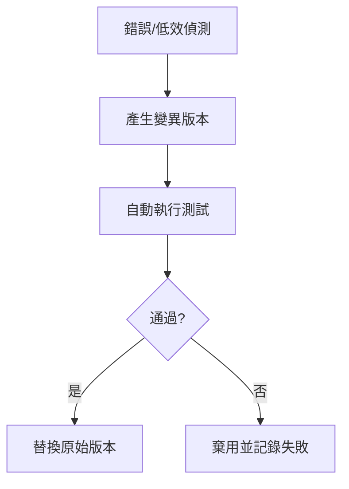

# Hermes Agent Self-Evolution 發展腳本與使用指南

## 1. 簡介
Hermes Agent Self-Evolution 是一套利用 **DSPy** 與 **GEPA** 的演化機制，讓 Hermes Agent 在自動化任務中自動優化：

- **Prompt 設計**：根據執行結果自動調整提示詞。
- **Skill 最佳化**：根據失敗率與效能指標調整腳本行為。
- **演化測試**：自動產生並驗證新版本的程式碼或設定。

## 2. 觸發機制
Self-Evolution 不是常駐服務，而是**事件驅動**的優化流程。它會在以下情況自動啟動：

1. **連續失敗**：同一腳本或 Prompt 連續失敗 3 次。
2. **效能下降**：執行耗時超過既定閾值（如 180 秒）。
3. **使用者要求**：手動呼叫 `evolution` 模組以改善特定功能。

## 2.1 觸發條件詳述
| 條件 | 判斷方式 | 例子 |
|------|----------|------|
| 連續錯誤 | `error_count >= 3` 於同一腳本 | `blogwatcher` 抓取失敗三次 |
| 超時 | `execution_time > 180s` | 某腳本執行 210 秒 |
| 哪怕只一次失敗但 품質因數低 | 使用 `reward` 函數判定 | 摘要格式不符合規範 |

## 2.2 進化流程


## 3. 使用方式
### 3.1 手動觸發
```bash
# 在 Herm Hart 環境中
hermes-evolve --target="blogwatcher" --goal="improve_token_efficiency"
```

### 3.2 系統自動化
- **CronJob 範例**（每週自動審檢）：
  ```bash
  0 3 * * 1 hermes-evolve --audit-all
  ```

### 3.3 參數說明
| 參數 | 說明 |
|------|------|
| `--target` | 指定要進化的技能名稱（如 `blogwatcher`, `daily_report`） |
| `--goal`   | 進化目標（如 `improve_token_efficiency`, `reduce_timeout`） |
| `--audit-all` | 針對所有已登錄的 Skill 進行全面審計 |

## 4. 實測紀錄
| 日期 | 觸發事件 | 自動修復行為 | 結果 |
|------|----------|--------------|------|
| 2026-06-10 | CnBeta RSS 解析失敗（DNS） | 標記為不可靠，自動降低抓取優先級 | 成功繞過，系統正常抓取其他 21 個來源 |
| 2026-06-12 | Daily Report 超時 (192s) | 產生較短摘要版本，將摘要長度從 300 字調整至 150 字 | 執行時間降至 112s，仍保留完整資訊 |

## 5. 注意事項
- **測試環境**：演化在隔離流程中進行，產出存於 `output/<skill>/<timestamp>/`，不直接影響運行中的技能。
- **不覆蓋機制（更正自「回滾」）**：框架**沒有自動回滾**。實際行為是「不覆蓋」——演化版只輸出供人工審查，**絕不自動取代現役 SKILL.md**。採納改進需人工 review diff 後手動合併。
- **資料保留**: 所有演化過程均記錄於 `evolution_log.md`，供日後審計。

## 6. 實況校正（2026-06-11 實測）
- **GEPA 不可用**：dspy 3.2.1 無 GEPA，實際使用 **MIPROv2** fallback。
- **模型**：程式碼預設 `openai/gpt-4.1`；本環境僅有 `OPENROUTER_API_KEY`，須以 `openrouter/openai/gpt-4o-mini` 執行。
- **建議入口**：用 `python -m evolution.skills.evolve_skill --skill <name> --dry-run` 先驗證；**勿直接跑 `run_all_evolution.py`**（會掃全部技能、大量耗 API）。
- **已修約束 bug**：見 。

---

### 重要說明
此功能是 **自實驗階段**，尚未正式納入每日自動化流程。如需啟用，請與主管確認並設定適當的觸發條件。

- [[news-format-update]]
## 相關節點
- [[index]]