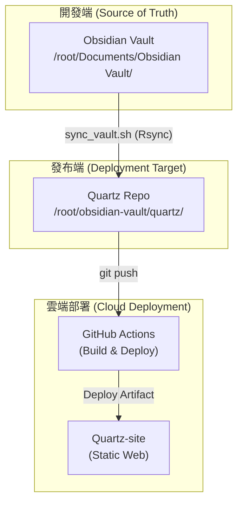

# Quartz 5 目標執行架構 (Target Execution Architecture)

## 1. 系統架構圖 (Architecture Diagram)



## 2. 目錄結構與職責說明

### A. 開發端 (Development Zone)
這是你的靈魂，所有的思考與編輯都在此進行。
```text
/root/Documents/Obsidian Vault/
├── concepts/           # 概念筆記 (核心知識)
├── entities/           # 實體資料 (資料庫結構)
├── projects/           # 專案紀錄
├── notes/              # 隨手筆記
└── system/             # 系統文件 (如本文件、SOP)
```
* **角色**：唯一的事實來源 (Source of Truth)。
* **操作**：使用 Obsidian 進行編輯、管理 YAML Metadata。

### B. 發布端 (Deployment Zone)
這是 Quartz 的引擎，負責將 Markdown 轉換為網頁。
```text
/root/obsidian-vault/quartz/
├── content/            # 【同步目標】存放從 Obsidian 鏡像過來的內容
├── quartz.config.yaml  # Quartz 核心設定 (baseUrl, plugins, theme)
├── package.json        # Node.js 依賴管理
├── bootstrap-cli.mjs   # Quartz 執行指令
└── public/             # 【建置產物】由 Quartz 產生的靜態 HTML/CSS/JS
```
* **角色**：建置引擎與發行緩衝。
* **操作**：**禁止直接在此編輯筆記**。僅透過 `sync_vault.sh` 接收內容，並透過 `git push` 觸發部署。

## 3. 核心工作流 (Core Workflow)

1. **編輯**：在 `Obsidian Vault/` 進行所有修改。
2. **同步**：執行 `/root/obsidian-vault/sync_vault.sh` $\rightarrow$ 內容從「開發端」同步至「發布端」的 `content/`。
3. **推送**：同步腳本自動將變動 `git push` 至 GitHub。
4. **部署**：GitHub Actions 偵測到推送 $\rightarrow$ 自動建置 HTML $\rightarrow$ 部署至 `quartz-site` 靜態網頁。

---
*最後更新：2026-06-17*
